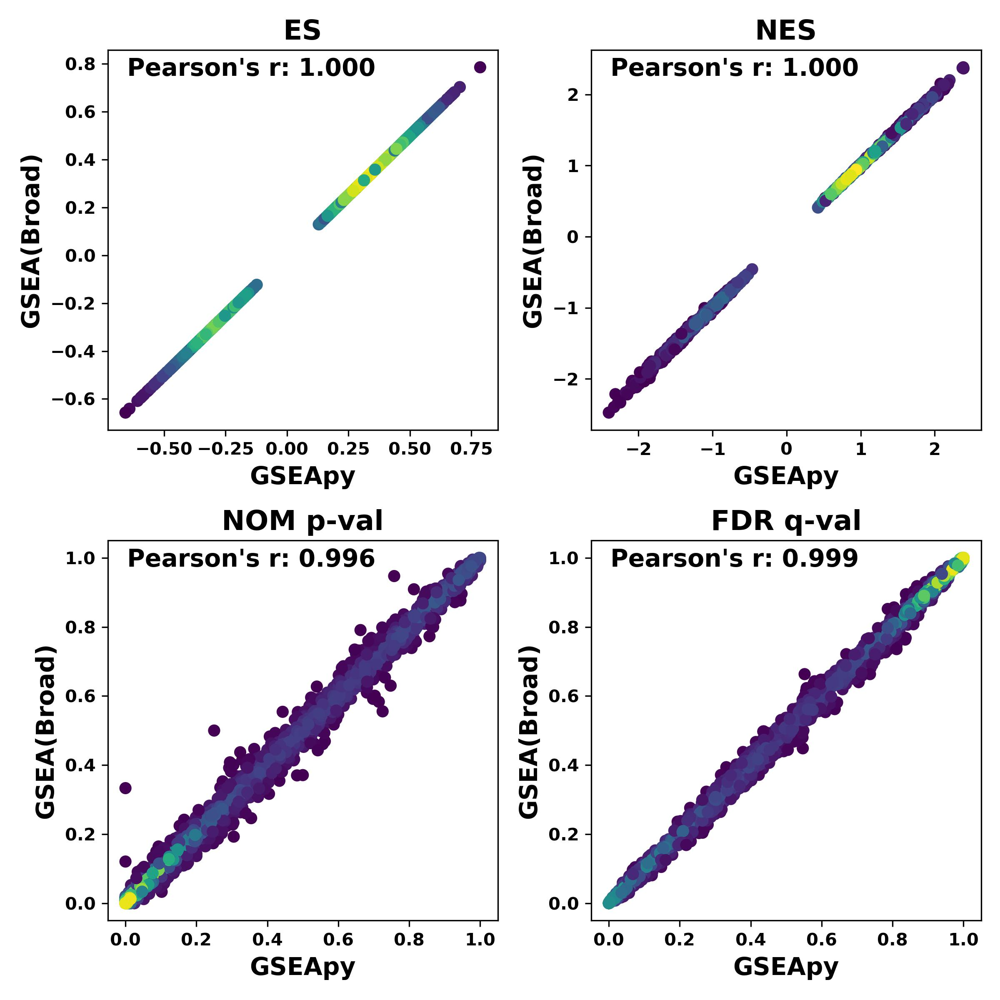

GSEApy
========

GSEApy: Gene Set Enrichment Analysis in Python.
------------------------------------------------

.. image:: https://badge.fury.io/py/gseapy.svg
    :target: https://badge.fury.io/py/gseapy

.. image:: https://img.shields.io/conda/vn/bioconda/GSEApy.svg?style=plastic
    :target: http://bioconda.github.io

.. image:: https://anaconda.org/bioconda/gseapy/badges/downloads.svg   
    :target: https://anaconda.org/bioconda/gseapy

.. image:: https://github.com/zqfang/GSEApy/workflows/GSEApy/badge.svg?branch=master
    :target: https://github.com/zqfang/GSEApy/actions
    :alt: Action Status

.. image:: http://readthedocs.org/projects/gseapy/badge/?version=master
    :target: http://gseapy.readthedocs.io/en/master/?badge=master
    :alt: Documentation Status

.. image:: https://img.shields.io/badge/license-MIT-blue.svg
    :target:  https://img.shields.io/badge/license-MIT-blue.svg

.. image:: https://img.shields.io/pypi/pyversions/gseapy.svg
    :alt: PyPI - Python Version

**Release notes** : https://github.com/zqfang/GSEApy/releases

`Tutorial for scRNA-seq datasets <https://gseapy.readthedocs.io/en/latest/singlecell_example.html#>`_

`Tutorial for general usage <https://gseapy.readthedocs.io/en/latest/gseapy_example.html>`_

Citation
------------------------------------
::

    Zhuoqing Fang, Xinyuan Liu, Gary Peltz, GSEApy: a comprehensive package for performing gene set enrichment analysis in Python, 
    Bioinformatics, 2022;, btac757, https://doi.org/10.1093/bioinformatics/btac757

GSEApy is a Python/Rust implementation for **GSEA** and wrapper for **Enrichr**.
--------------------------------------------------------------------------------------------

GSEApy can be used for **RNA-seq, ChIP-seq, Microarray** data. It can be used for convenient GO enrichment and to produce **publication quality figures** in python.

GSEApy has 7 sub-commands available: ``gsea``, ``prerank``, ``ssgsea``, ``gsva``, ``replot`` ``enrichr``, ``biomart``.

:gsea:    The ``gsea`` module produces `GSEA  <http://www.broadinstitute.org/cancer/software/gsea/wiki/index.php/Main_Page>`_ results.  The input requries a txt file(FPKM, Expected Counts, TPM, et.al), a cls file, and gene_sets file in gmt format.
:prerank: The ``prerank`` module produces **Prerank tool** results.  The input expects a pre-ranked gene list dataset with correlation values, provided in .rnk format, and gene_sets file in gmt format.  ``prerank`` module is an API to `GSEA` pre-rank tools.
:ssgsea: The ``ssgsea`` module performs **single sample GSEA(ssGSEA)** analysis.  The input expects a pd.Series (indexed by gene name), or a pd.DataFrame (include ``GCT`` file) with expression values and a ``GMT`` file. For multiple sample input, ssGSEA reconigzes gct format, too. ssGSEA enrichment score for the gene set is described by `D. Barbie et al 2009 <http://www.nature.com/nature/journal/v462/n7269/abs/nature08460.html>`_.
:gsva: The ``gsva`` module performs `GSVA <https://github.com/rcastelo/GSVA>`_ method by `Hänzelmann et al <https://bmcbioinformatics.biomedcentral.com/articles/10.1186/1471-2105-14-7>`_. The input is same to ssgsea.
:replot: The ``replot`` module reproduce GSEA desktop version results.  The only input for GSEApy is the location to ``GSEA`` Desktop output results.
:enrichr: The ``enrichr`` module enable you perform gene set enrichment analysis using ``Enrichr`` API. Enrichr is open source and freely available online at: http://amp.pharm.mssm.edu/Enrichr . It runs very fast.
:biomart: The ``biomart`` module helps you convert gene ids using BioMart API.

Please use 'gseapy COMMAND -h' to see the detail description for each option of each module.

The full ``GSEA`` is far too extensive to describe here; see
`GSEA  <http://www.broadinstitute.org/cancer/software/gsea/wiki/index.php/Main_Page>`_ documentation for more information. All files' formats for GSEApy are identical to ``GSEA`` desktop version.

Why GSEApy
-----------------------------------------------------

I would like to use Pandas to explore my data, but I did not find a convenient tool to
do gene set enrichment analysis in python. So, here are my reasons:

* **Ability to run inside python interactive console without having to switch to R!!!**
* User friendly for both wet and dry lab users.
* Produce or reproduce publishable figures.
* Perform batch jobs easy.
* Easy to use in bash shell or your data analysis workflow, e.g. snakemake.

GSEApy vs GSEA(Broad) output
-----------------------------------------------
Using the same data for ``GSEAPreranked``, and ``GSEApy`` reproduce similar results.

See more output here: `Example <http://gseapy.readthedocs.io/en/master/gseapy_example.html>`_

Installation
------------

| Install gseapy package from bioconda or pip.

.. code:: shell

   # if you have conda (MacOS_x86-64 and Linux only)
   $ conda install -c bioconda gseapy
   # Windows and MacOS_ARM64(M1/2-Chip)
   $ pip install gseapy

| If pip install failed, use

.. code:: shell

   # you need to install rust first to compile the code
   curl https://sh.rustup.rs -sSf | sh -s -- -y
   # export rust compiler 
   export PATH="$PATH:$HOME/.cargo/bin"
   # install
   $ pip install git+git://github.com/zqfang/gseapy.git#egg=gseapy

Dependency
--------------
* Python 3.7+

Mandatory
~~~~~~~~~

* build
    * Rust: For gseapy > 0.11.0, Rust compiler is needed
    * setuptools-rust
* run
    * Numpy >= 1.13.0
    * Scipy
    * Pandas
    * Matplotlib
    * Requests

Run GSEApy
-----------------

For command line usage:
~~~~~~~~~~~~~~~~~~~~~~~

.. code:: bash

  # An example to reproduce figures using replot module.
  $ gseapy replot -i ./Gsea.reports -o test

  # An example to run GSEA using gseapy gsea module
  $ gseapy gsea -d exptable.txt -c test.cls -g gene_sets.gmt -o test

  # An example to run Prerank using gseapy prerank module
  $ gseapy prerank -r gsea_data.rnk -g gene_sets.gmt -o test

  # An example to run ssGSEA using gseapy ssgsea module
  $ gseapy ssgsea -d expression.txt -g gene_sets.gmt -o test

  # An example to run GSVA using gseapy ssgsea module
  $ gseapy gsva -d expression.txt -g gene_sets.gmt -o test

  # An example to use enrichr api
  # see details for -g input -> ``get_library_name`` 
  $ gseapy enrichr -i gene_list.txt -g KEGG_2016 -o test

Run gseapy inside python console:
~~~~~~~~~~~~~~~~~~~~~~~~~~~~~~~~~~~~~~~~~~~~~~~~~~~~~~~~~~~~~~~~~~~~~~~~~~~~~~~

1. Prepare expression.txt, gene_sets.gmt and test.cls required by GSEA, you could do this

.. code:: python

    import gseapy

    # run GSEA.
    gseapy.gsea(data='expression.txt', gene_sets='gene_sets.gmt', cls='test.cls', outdir='test')

    # run prerank
    gseapy.prerank(rnk='gsea_data.rnk', gene_sets='gene_sets.gmt', outdir='test')

    # run ssGSEA
    gseapy.ssgsea(data="expression.txt", gene_sets= "gene_sets.gmt", outdir='test')

    # run GSVA
    gseapy.gsva(data="expression.txt", gene_sets= "gene_sets.gmt", outdir='test')

    # An example to reproduce figures using replot module.
    gseapy.replot(indir='./Gsea.reports', outdir='test')

2. If you prefer to use Dataframe, dict, list in interactive python console, you could do this.

see detail here: `Example <http://gseapy.readthedocs.io/en/master/gseapy_example.html>`_

.. code:: python

    # assign dataframe, and use enrichr library data set 'KEGG_2016'
    expression_dataframe = pd.DataFrame()

    sample_name = ['A','A','A','B','B','B'] # always only two group,any names you like

    # assign gene_sets parameter with enrichr library name or gmt file on your local computer.
    gseapy.gsea(data=expression_dataframe, gene_sets='KEGG_2016', cls= sample_names, outdir='test')

    # prerank tool
    gene_ranked_dataframe = pd.DataFrame()
    gseapy.prerank(rnk=gene_ranked_dataframe, gene_sets='KEGG_2016', outdir='test')

    # ssGSEA
    gseapy.ssgsea(data=expression_dataframe, gene_sets='KEGG_2016', outdir='test')

    # gsva
    gseapy.gsva(data=expression_dataframe, gene_sets='KEGG_2016', outdir='test')

3. For ``enrichr`` , you could assign a list, pd.Series, pd.DataFrame object, or a txt file (should be one gene name per row.)

.. code:: python

    # assign a list object to enrichr
    gl = ['SCARA3', 'LOC100044683', 'CMBL', 'CLIC6', 'IL13RA1', 'TACSTD2', 'DKKL1', 'CSF1',
         'SYNPO2L', 'TINAGL1', 'PTX3', 'BGN', 'HERC1', 'EFNA1', 'CIB2', 'PMP22', 'TMEM173']

    gseapy.enrichr(gene_list=gl, gene_sets='KEGG_2016', outdir='test')

    # or a txt file path.
    gseapy.enrichr(gene_list='gene_list.txt', gene_sets='KEGG_2016',
                   outdir='test', cutoff=0.05, format='png' )

GSEApy supported gene set libaries :
~~~~~~~~~~~~~~~~~~~~~~~~~~~~~~~~~~~~~~~~~~~~~~~~~~~

To see the full list of gseapy supported gene set libraries, please click here: `Library <http://amp.pharm.mssm.edu/Enrichr/#stats>`_

Or use ``get_library_name`` function inside python console.

.. code:: python

    #see full list of latest enrichr library names, which will pass to -g parameter:
    names = gseapy.get_library_name()

    # show top 20 entries.
    print(names[:20])

   ['Genome_Browser_PWMs',
   'TRANSFAC_and_JASPAR_PWMs',
   'ChEA_2013',
   'Drug_Perturbations_from_GEO_2014',
   'ENCODE_TF_ChIP-seq_2014',
   'BioCarta_2013',
   'Reactome_2013',
   'WikiPathways_2013',
   'Disease_Signatures_from_GEO_up_2014',
   'KEGG_2016',
   'TF-LOF_Expression_from_GEO',
   'TargetScan_microRNA',
   'PPI_Hub_Proteins',
   'GO_Molecular_Function_2015',
   'GeneSigDB',
   'Chromosome_Location',
   'Human_Gene_Atlas',
   'Mouse_Gene_Atlas',
   'GO_Cellular_Component_2015',
   'GO_Biological_Process_2015',
   'Human_Phenotype_Ontology',]

Dev 
~~~~~~~~~~~~~~~~~~~~~~~~~~~~~

.. code:: shell

        # test rust extension only 
        cargo test --features=extension-module
        # test whole package
        python setup.py test

Bug Report
~~~~~~~~~~~~~~~~~~~~~~~~~~~

If you would like to report any bugs when use gseapy, don't hesitate to create an issue on github here.

To get help of GSEApy
------------------------------------

1. See `Frequently Asked Questions <https://gseapy.readthedocs.io/en/latest/faq.html>`_

2. Visit the document site at `Examples <https://gseapy.readthedocs.io/en/latest/gseapy_example.html>`_

3. The GSEApy discussion channel: `Q&A <https://github.com/zqfang/GSEApy/discussions>`_ 

