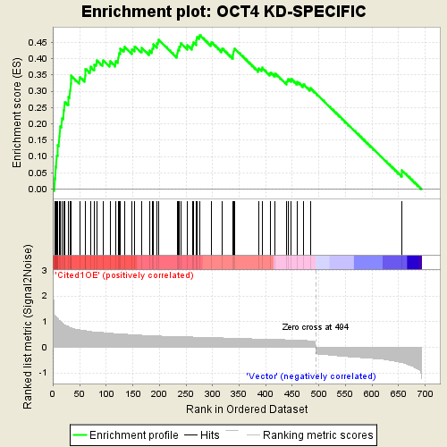
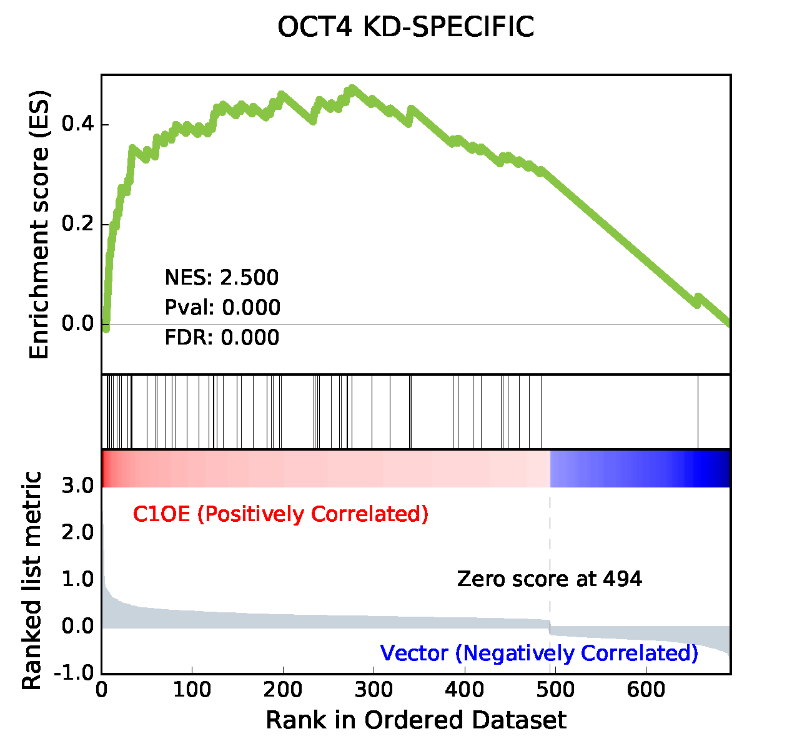

Gseapy
========

Gseapy is a python wrapper for **GESA**. 

`Gene Set Enrichment Analysis <http://software.broadinstitute.org/gsea/index.jsp>`_ (GSEA) is a computational method that determines whether an a priori defined set of genes shows statistically significant, concordant differences between two biological states (e.g. phenotypes). 
However, the R version of GSEA had not been updated since 2006. 
Although the best choice of GSEA is the desktop Java version, this version did not provide means to 
modify plots, like legends, ticks......

Gseapy is aim to become a python wrapper of GSEA. It is used for convenient GO 
enrichments and produce **publishable quality figures** from python. For use in ``python`` projects.

For now, gseapy only reproduce the gsea plot generated by GSEA desktop version. 

**Plan for gseapy**

#. Reproduce the GSEA plot from GSEA desktop output.

#. Future version of gesapy will include the statistical part of GSEA.

#. Something to do

GSEA desktop version output: 
-------------------------------------------------

    This is an example of GSEA desktop application output
   
    Generated by GSEA desktop version

gseapy output
-----------------------------------------------

   Using the same algorithm by GSEA, gseapy reproduce the example above.
   
   Generated by gseapy

Installation
------------

| Install package from pypi and download 

.. code:: shell

   $ pip install gseapy

| You may instead want to use the development version from Github, by running

.. code:: shell

   $ pip install git+git://github.com/BioNinja/gseapy.git#egg=gseapy

Dependency
--------------

Numpy, pandas, matplotlib, beautifulsoup4

   
Run GSEAPY
-----------------

| Gseapy will parse the GSEA desktop output directory. 
| The only input is the location of of each GSEA result files inside the **edb** folder. 
| For more details,see below. 

For help:

.. code:: shell
   
   $ gseapy --help 
   
   usage: gseapy [-h] [-i FILE] [-o OUT] [--version]

   optional arguments:
  -h, --help            show this help message and exit
  -i FILE, --InDir FILE
                        the GSEA desktop results directroy that you want to reproduce
                        the figure
  -o OUT, --outDir OUT  the gseapy output directory
  --version             show program's version number and exit

For commandline usage:

.. code:: shell
  
  $ gseapy -i path/to/gsea_edb_file_location -o gesapy_out

Run gseapy inside python:

.. code:: python
  
  from bs4 import BeautifulSoup
  from gseapy.gsea import *
  import glob

  file_name = "./data"
  results_path = glob.glob(file_name+'*/edb/results.edb')[0]
  rank_path =  glob.glob(file_name+'*/edb/*.rnk')[0]
  gene_set_path =  glob.glob(file_name+'*/edb/gene_sets.gmt')[0]
  cls_path = glob.glob(file_name+'*/edb/*.cls')[0]

  #extract sample names from .cls file
  phenoPos,phenoNeg = gsea_cls_parser(cls_path)  
    
  #extract each enriment term in the results.edb files and plot.
  database = BeautifulSoup(open(results_path),features='xml')
  length = len(database.findAll('DTG'))
    
  for idx in range(length):
      #extract statistical resutls from results.edb file
      enrich_term,es_profile,hit_ind, nes,pval,fdr,rank_es = gsea_edb_parser( results_path,index=idx)
      
      #obtain rank_metrics
      rank_metric = gsea_rank_metric(rank_path)
      correl_vector =  rank_metric['rank'].values

      #obtain gene sets
      gene_set_dict = gsea_gmt_parser(gene_set_path)
      gene_set = gene_set_dict.get(enrich_term)
      gene_list = rank_metric['gene_name']

      #calculate enrichment score    
      RES = enrichment_score(gene_list = gene_list, gene_set = gene_set, weighted_score_type = 1, 
                               correl_vector = correl_vector)

      #plotting
      fig = gsea_plot(rank_metric, enrich_term,es_profile,hit_ind,nes,pval,fdr,
                      RES, phenoPos,phenoNeg, figsize=(6.5,6))
      fig.savefig('./'+enrich_term+'.png',format='png',dpi=300,)
