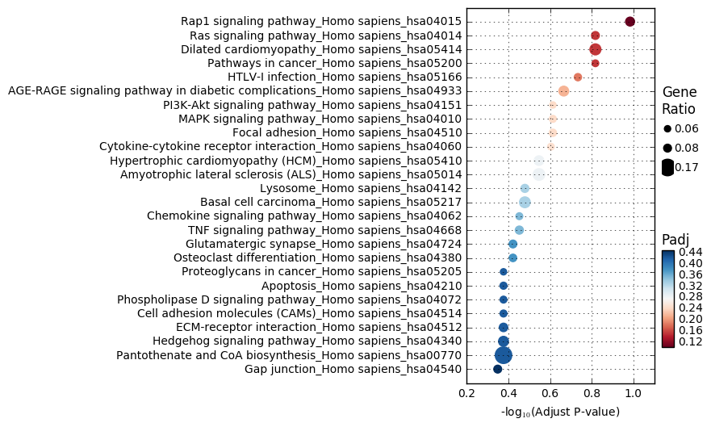

GSEAPY Example
==============

Examples to walk through ``GSEA`` and enrichr
---------------------------------------------

1. Load essential packages
==========================

.. code:: python

    %matplotlib inline
    import pandas as pd
    import gseapy as gp
    import matplotlib.pyplot as plt

\*\* Check gseapy version \*\*

.. code:: python

    gp.__version__

.. parsed-literal::

    '0.7.2'

See all gseapy supported enrichr library names
==============================================

Enrichr library could be used for ``call`` and ``prerank``, too

.. code:: python

    names = gp.get_library_name()
    names[:10]

.. parsed-literal::

    ['Achilles_fitness_decrease',
     'Achilles_fitness_increase',
     'Aging_Perturbations_from_GEO_down',
     'Aging_Perturbations_from_GEO_up',
     'Allen_Brain_Atlas_down',
     'Allen_Brain_Atlas_up',
     'BioCarta_2013',
     'BioCarta_2015',
     'BioCarta_2016',
     'CORUM']

2. Enrichr Example
==================

i. Assign enrichr with gene list object
---------------------------------------

.. code:: python

    gene_list = pd.read_table("./gene_list.txt",header=None)
    gene_list.head()

.. raw:: html

    

    <table border="1" class="dataframe">
      <thead>
        <tr style="text-align: right;">
          <th></th>
          <th>0</th>
        </tr>
      </thead>
      <tbody>
        <tr>
          <th>0</th>
          <td>CTLA2B</td>
        </tr>
        <tr>
          <th>1</th>
          <td>SCARA3</td>
        </tr>
        <tr>
          <th>2</th>
          <td>LOC100044683</td>
        </tr>
        <tr>
          <th>3</th>
          <td>CMBL</td>
        </tr>
        <tr>
          <th>4</th>
          <td>CLIC6</td>
        </tr>
      </tbody>
    </table>
    

.. code:: python

    glist = gene_list.squeeze().tolist()
    print(glist[:10])

.. parsed-literal::

    ['CTLA2B', 'SCARA3', 'LOC100044683', 'CMBL', 'CLIC6', 'IL13RA1', 'TACSTD2', 'DKKL1', 'CSF1', 'CITED1']
    

.. code:: python

    # run gseapy 
    enrichr_results = gp.enrichr(gene_list=glist, description='test_name', gene_sets='KEGG_2016', outdir='enrichr_kegg', cutoff=0.5)
    # and provide a txt file for enrichr will also work
    #enrichr_results = gp.enrichr(gene_list='./gene_list.txt', description='KEGG', gene_sets='KEGG_2016', outdir='enrichr_kegg')

.. parsed-literal::

    2016-10-20 12:45:00,587 Connecting to Enrichr Server to get latest library names
    2016-10-20 12:45:02,713 Analysis name: test_name Enrichr Library: KEGG_2016
    2016-10-20 12:45:07,271 Downloading file of enrichment results: Job Id:{'userListId': 1760726, 'shortId': 'jewl'}
    2016-10-20 12:45:10,722 Enrichr: You are seeing this message, because you are inside python console.
    Enrichr: It will return a pandas dataframe for veiwing results.
    2016-10-20 12:45:10,737 Enrichr: Job Done!
    

.. code:: python

    enrichr_results.ix[:5,:6]

.. raw:: html

    

    <table border="1" class="dataframe">
      <thead>
        <tr style="text-align: right;">
          <th></th>
          <th>Term</th>
          <th>Overlap</th>
          <th>P-value</th>
          <th>Adjusted P-value</th>
          <th>Z-score</th>
          <th>Combined Score</th>
        </tr>
      </thead>
      <tbody>
        <tr>
          <th>0</th>
          <td>Rap1 signaling pathway_Homo sapiens_hsa04015</td>
          <td>19/211</td>
          <td>0.000436</td>
          <td>0.103734</td>
          <td>-1.961363</td>
          <td>4.444307</td>
        </tr>
        <tr>
          <th>1</th>
          <td>Pathways in cancer_Homo sapiens_hsa05200</td>
          <td>27/397</td>
          <td>0.001816</td>
          <td>0.152127</td>
          <td>-2.083086</td>
          <td>3.922533</td>
        </tr>
        <tr>
          <th>2</th>
          <td>Ras signaling pathway_Homo sapiens_hsa04014</td>
          <td>18/227</td>
          <td>0.002351</td>
          <td>0.152127</td>
          <td>-1.956845</td>
          <td>3.684817</td>
        </tr>
        <tr>
          <th>3</th>
          <td>Dilated cardiomyopathy_Homo sapiens_hsa05414</td>
          <td>10/90</td>
          <td>0.002557</td>
          <td>0.152127</td>
          <td>-1.805957</td>
          <td>3.400689</td>
        </tr>
        <tr>
          <th>4</th>
          <td>HTLV-I infection_Homo sapiens_hsa05166</td>
          <td>19/258</td>
          <td>0.003877</td>
          <td>0.184562</td>
          <td>-1.843079</td>
          <td>3.114379</td>
        </tr>
        <tr>
          <th>5</th>
          <td>AGE-RAGE signaling pathway in diabetic complic...</td>
          <td>10/101</td>
          <td>0.005440</td>
          <td>0.215802</td>
          <td>-1.919166</td>
          <td>2.942840</td>
        </tr>
      </tbody>
    </table>
    

ii . Commandline usage
======================

You may also want to use enrichr in commandline, but not DataFrame will
print return to the console.

.. code:: python

    !gseapy enrichr -i ./gene_list.txt -d KEGG -g KEGG_2016 -o KEGG_2016_2

.. parsed-literal::

    2016-10-20 12:45:14,716 Connecting to Enrichr Server to get latest library names
    2016-10-20 12:45:17,106 Analysis name: KEGG Enrichr Library: KEGG_2016
    2016-10-20 12:45:21,753 Downloading file of enrichment results: Job Id:{'userListId': 1760727, 'shortId': 'jewm'}
    2016-10-20 12:45:22,628 Enrichr: Job Done!
    

3. Prerank example
==================

i. Assign prank with a pandas DataFrame
---------------------------------------

.. code:: python

    rank = pd.read_table("./edb/gsea_data.gsea_data.rnk",header=None)
    rank.head()

.. raw:: html

    

    <table border="1" class="dataframe">
      <thead>
        <tr style="text-align: right;">
          <th></th>
          <th>0</th>
          <th>1</th>
        </tr>
      </thead>
      <tbody>
        <tr>
          <th>0</th>
          <td>CTLA2B</td>
          <td>2.502482</td>
        </tr>
        <tr>
          <th>1</th>
          <td>SCARA3</td>
          <td>2.095578</td>
        </tr>
        <tr>
          <th>2</th>
          <td>LOC100044683</td>
          <td>1.116398</td>
        </tr>
        <tr>
          <th>3</th>
          <td>CMBL</td>
          <td>0.877640</td>
        </tr>
        <tr>
          <th>4</th>
          <td>CLIC6</td>
          <td>0.822181</td>
        </tr>
      </tbody>
    </table>
    

.. code:: python

    # run prerank
    # enrichr library are supported by prerank module. Just provide the name
    prerank_results = gp.prerank(rnk=rank, gene_sets='./edb/gene_sets.gmt', outdir='prerank_report2')
    
    # or give enrichr names
    #prerank_results = gp.prerank(rnk="./edb/gsea_data.gsea_data.rnk",gene_sets='KEGG_2016',outdir='prerank_report')

.. parsed-literal::

    2016-10-20 12:45:22,900 Parsing data files for GSEA.............................
    2016-10-20 12:45:22,944 7 gene_sets used for further statistical testing.....
    2016-10-20 12:45:22,946 Start to run GSEA...Might take a while..................
    2016-10-20 12:45:24,688 Start to generate gseapy reports, and produce figures...
    2016-10-20 12:45:29,308 Congratulations...GSEAPY run successfully...............
    

.. code:: python

    prerank_results.ix[:5,:6]

.. raw:: html

    

    <table border="1" class="dataframe">
      <thead>
        <tr style="text-align: right;">
          <th></th>
          <th>es</th>
          <th>nes</th>
          <th>pval</th>
          <th>fdr</th>
          <th>gene_set_size</th>
          <th>matched_size</th>
        </tr>
        <tr>
          <th>Term</th>
          <th></th>
          <th></th>
          <th></th>
          <th></th>
          <th></th>
          <th></th>
        </tr>
      </thead>
      <tbody>
        <tr>
          <th>ES-SPECIFIC</th>
          <td>-0.485630</td>
          <td>-2.487222</td>
          <td>0.000000</td>
          <td>0.000000</td>
          <td>25</td>
          <td>25</td>
        </tr>
        <tr>
          <th>OCT4 KD-SPECIFIC</th>
          <td>0.474139</td>
          <td>2.486317</td>
          <td>0.000000</td>
          <td>0.000000</td>
          <td>60</td>
          <td>60</td>
        </tr>
        <tr>
          <th>CDX2 OE-SPECIFIC</th>
          <td>0.505286</td>
          <td>2.283415</td>
          <td>0.001379</td>
          <td>0.000487</td>
          <td>33</td>
          <td>33</td>
        </tr>
        <tr>
          <th>TS-SPECIFIC</th>
          <td>0.446409</td>
          <td>2.100429</td>
          <td>0.002710</td>
          <td>0.001947</td>
          <td>39</td>
          <td>39</td>
        </tr>
        <tr>
          <th>GATA3 OE-SPECIFIC</th>
          <td>0.370833</td>
          <td>1.751660</td>
          <td>0.019582</td>
          <td>0.026280</td>
          <td>40</td>
          <td>40</td>
        </tr>
      </tbody>
    </table>
    

.. code:: python

    prerank_results = prerank_results.reset_index()
    prerank_results.head(5).plot.barh(y='fdr',x='Term')

.. parsed-literal::

    <matplotlib.axes._subplots.AxesSubplot at 0x2548cb4dbe0>

.. image:: output_19_1.png

ii . Commandline usage
======================

You may also want to use prerank in commandline, but not DataFrame will
print return to the console.

.. code:: python

    ! gseapy prerank -r ./edb/gsea_data.gsea_data.rnk -g KEGG_2016 -o prerank_report_2

.. parsed-literal::

    2016-10-20 12:45:32,976 Parsing data files for GSEA.............................
    2016-10-20 12:45:41,315 7 gene_sets used for further statistical testing.....
    2016-10-20 12:45:41,315 Start to run GSEA...Might take a while..................
    2016-10-20 12:45:42,847 Start to generate gseapy reports, and produce figures...
    2016-10-20 12:45:48,008 Congratulations...GSEAPY run successfully...............
    

4. Call Example
===============

i. Assign call with a pandas DataFrame
--------------------------------------

and cls with a list object

.. code:: python

    phenoA,phenoB,class_vector =  gp.parser.gsea_cls_parser("./P53.cls")

.. code:: python

    print(class_vector)

.. parsed-literal::

    ['MUT', 'MUT', 'MUT', 'MUT', 'MUT', 'MUT', 'MUT', 'MUT', 'MUT', 'MUT', 'MUT', 'MUT', 'MUT', 'MUT', 'MUT', 'MUT', 'MUT', 'MUT', 'MUT', 'MUT', 'MUT', 'MUT', 'MUT', 'MUT', 'MUT', 'MUT', 'MUT', 'MUT', 'MUT', 'MUT', 'MUT', 'MUT', 'MUT', 'WT', 'WT', 'WT', 'WT', 'WT', 'WT', 'WT', 'WT', 'WT', 'WT', 'WT', 'WT', 'WT', 'WT', 'WT', 'WT', 'WT']
    

.. code:: python

    gene_exp = pd.read_table("./P53_resampling_data.txt")
    gene_exp.head()

.. raw:: html

    

    <table border="1" class="dataframe">
      <thead>
        <tr style="text-align: right;">
          <th></th>
          <th>NAME</th>
          <th>786-0</th>
          <th>BT-549</th>
          <th>CCRF-CEM</th>
          <th>COLO 205</th>
          <th>EKVX</th>
          <th>HCC-2998</th>
          <th>HCT-15</th>
          <th>HOP-62</th>
          <th>HOP-92</th>
          <th>...</th>
          <th>MCF7</th>
          <th>MOLT-4</th>
          <th>NCI-H460</th>
          <th>OVCAR-4</th>
          <th>SF-539</th>
          <th>SK-MEL-5</th>
          <th>SR</th>
          <th>UACC-257</th>
          <th>UACC-62</th>
          <th>UO-31</th>
        </tr>
      </thead>
      <tbody>
        <tr>
          <th>0</th>
          <td>CTLA2B</td>
          <td>111.19</td>
          <td>86.22</td>
          <td>121.85</td>
          <td>75.19</td>
          <td>208.62</td>
          <td>130.59</td>
          <td>124.72</td>
          <td>324.09</td>
          <td>242.71</td>
          <td>...</td>
          <td>163.76</td>
          <td>59.50</td>
          <td>134.12</td>
          <td>152.09</td>
          <td>197.46</td>
          <td>137.79</td>
          <td>81.53</td>
          <td>123.37</td>
          <td>81.41</td>
          <td>180.78</td>
        </tr>
        <tr>
          <th>1</th>
          <td>SCARA3</td>
          <td>460.30</td>
          <td>558.34</td>
          <td>183.55</td>
          <td>37.29</td>
          <td>158.00</td>
          <td>43.61</td>
          <td>80.83</td>
          <td>300.08</td>
          <td>1250.25</td>
          <td>...</td>
          <td>109.91</td>
          <td>120.42</td>
          <td>73.06</td>
          <td>115.03</td>
          <td>95.12</td>
          <td>37.56</td>
          <td>76.16</td>
          <td>41.10</td>
          <td>77.51</td>
          <td>519.17</td>
        </tr>
        <tr>
          <th>2</th>
          <td>LOC100044683</td>
          <td>97.25</td>
          <td>118.94</td>
          <td>81.17</td>
          <td>119.51</td>
          <td>119.88</td>
          <td>107.73</td>
          <td>165.57</td>
          <td>203.97</td>
          <td>135.43</td>
          <td>...</td>
          <td>222.84</td>
          <td>124.98</td>
          <td>114.75</td>
          <td>141.66</td>
          <td>170.19</td>
          <td>147.70</td>
          <td>157.48</td>
          <td>152.18</td>
          <td>98.89</td>
          <td>118.06</td>
        </tr>
        <tr>
          <th>3</th>
          <td>CMBL</td>
          <td>33.45</td>
          <td>55.10</td>
          <td>221.67</td>
          <td>50.30</td>
          <td>35.12</td>
          <td>75.70</td>
          <td>84.01</td>
          <td>44.12</td>
          <td>79.96</td>
          <td>...</td>
          <td>51.32</td>
          <td>117.11</td>
          <td>59.46</td>
          <td>78.46</td>
          <td>45.55</td>
          <td>49.07</td>
          <td>96.69</td>
          <td>33.09</td>
          <td>10.38</td>
          <td>52.89</td>
        </tr>
        <tr>
          <th>4</th>
          <td>CLIC6</td>
          <td>35.75</td>
          <td>41.26</td>
          <td>63.04</td>
          <td>219.86</td>
          <td>42.53</td>
          <td>54.19</td>
          <td>86.98</td>
          <td>71.20</td>
          <td>53.89</td>
          <td>...</td>
          <td>154.05</td>
          <td>31.62</td>
          <td>37.66</td>
          <td>32.64</td>
          <td>63.35</td>
          <td>27.95</td>
          <td>70.99</td>
          <td>36.25</td>
          <td>17.50</td>
          <td>49.41</td>
        </tr>
      </tbody>
    </table>
    
5 rows × 51 columns

    

.. code:: python

    # run call
    # enrichr library are supported by call module. Just provide the name
    # you may also provide a gene_sets file in gmt format, just like GSEA do.
    call_results = gp.call(data=gene_exp, gene_sets='KEGG_2016', cls=class_vector, outdir='call_reprot', method='signal_to_noise')
    
    # or provide a txt file will also work
    #call_results = gp.call(data='./P53_resampling_data.txt',gene_sets='edb/gene_sets.gmt',cls='./P53.cls',outdir='call_reprot',)

.. parsed-literal::

    2016-10-20 12:45:48,644 Parsing data files for GSEA.............................
    2016-10-20 12:45:57,963 7 gene_sets used for further statistical testing.....
    2016-10-20 12:45:57,963 Start to run GSEA...Might take a while..................
    2016-10-20 12:45:59,518 Start to generate gseapy reports, and produce figures...
    2016-10-20 12:46:13,504 Congratulations. GSEAPY run successfully...............
    

.. code:: python

    call_results.head(5)

.. raw:: html

    

    <table border="1" class="dataframe">
      <thead>
        <tr style="text-align: right;">
          <th></th>
          <th>es</th>
          <th>nes</th>
          <th>pval</th>
          <th>fdr</th>
          <th>gene_set_size</th>
          <th>matched_size</th>
          <th>genes</th>
        </tr>
        <tr>
          <th>Term</th>
          <th></th>
          <th></th>
          <th></th>
          <th></th>
          <th></th>
          <th></th>
          <th></th>
        </tr>
      </thead>
      <tbody>
        <tr>
          <th>HTLV-I infection_Homo sapiens_hsa05166</th>
          <td>-0.249752</td>
          <td>-0.742833</td>
          <td>0.828777</td>
          <td>0.815474</td>
          <td>258</td>
          <td>19</td>
          <td>[FZD2, ETS1, STAT5B, RRAS, LTBR, PPP3CC, TNFRS...</td>
        </tr>
        <tr>
          <th>MAPK signaling pathway_Homo sapiens_hsa04010</th>
          <td>-0.392928</td>
          <td>-1.156748</td>
          <td>0.279346</td>
          <td>0.831333</td>
          <td>255</td>
          <td>18</td>
          <td>[GADD45B, RRAS, SOS2, FGF17, PPP3CC, TNFRSF1A,...</td>
        </tr>
        <tr>
          <th>PI3K-Akt signaling pathway_Homo sapiens_hsa04151</th>
          <td>0.182245</td>
          <td>0.645624</td>
          <td>0.946203</td>
          <td>0.936590</td>
          <td>341</td>
          <td>22</td>
          <td>[GNG13, VEGFC, GNB4, CSF1, SOS2, FGF17, THBS4,...</td>
        </tr>
        <tr>
          <th>Rap1 signaling pathway_Homo sapiens_hsa04015</th>
          <td>-0.285975</td>
          <td>-0.859209</td>
          <td>0.651772</td>
          <td>0.994642</td>
          <td>211</td>
          <td>19</td>
          <td>[RRAS, VEGFC, CSF1, FGF17, PDGFRB, FGF4, PDGFC...</td>
        </tr>
        <tr>
          <th>Pathways in cancer_Homo sapiens_hsa05200</th>
          <td>0.201838</td>
          <td>0.754624</td>
          <td>0.871166</td>
          <td>1.111111</td>
          <td>397</td>
          <td>27</td>
          <td>[FZD2, ETS1, STAT5B, GNG13, VEGFC, GNB4, SOS2,...</td>
        </tr>
      </tbody>
    </table>
    

.. code:: python

    with plt.style.context('ggplot'):
        call_results = prerank_results.reset_index()
        call_results.head(5).plot.barh(y='fdr',x='Term')

.. image:: output_29_0.png

The **call** module will generate heatmap for genes in each gene sets in
the backgroud.

.. code:: python

    from IPython.display import Image
    
    #erich plot
    Image("./call_reprot/HTLV-I infection_Homo sapiens_hsa05166.gsea.png",width=650, height=600)

.. image:: output_31_0.png

.. code:: python

    #corresponding heatmap
    Image("./call_reprot/HTLV-I infection_Homo sapiens_hsa05166.heatmap.png")

.. image:: output_32_0.png

ii . Commandline usage
======================

You may also want to use call in commandline, but not DataFrame will
print return to the console.

.. code:: python

    !gseapy call -d ./P53_resampling_data.txt -g KEGG_2016 -c ./P53.cls -o call_reprot_2

.. parsed-literal::

    2016-10-20 12:46:17,176 Parsing data files for GSEA.............................
    2016-10-20 12:46:23,697 7 gene_sets used for further statistical testing.....
    2016-10-20 12:46:23,697 Start to run GSEA...Might take a while..................
    2016-10-20 12:46:25,224 Start to generate gseapy reports, and produce figures...
    2016-10-20 12:46:39,519 Congratulations. GSEAPY run successfully...............
    

