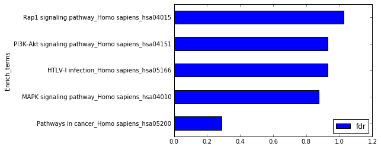
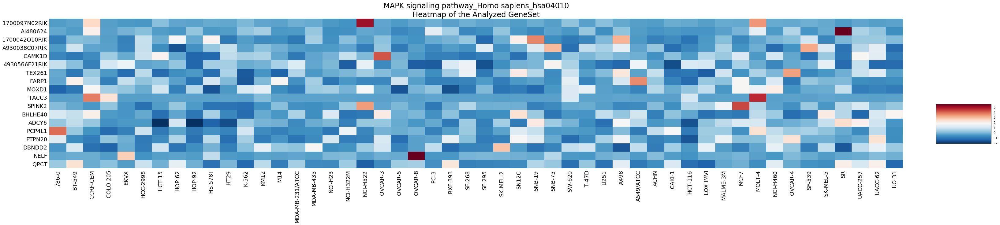

GSEAPY Example
==============

Examples to walk through ``GSEApy`` and enrichr
-----------------------------------------------

1. Load essential packages
==========================

.. code:: ipython3

    %matplotlib inline
    import pandas as pd
    import gseapy as gp
    import matplotlib.pyplot as plt

\*\* Check gseapy version \*\*

.. code:: ipython3

    gp.__version__

.. parsed-literal::

    '0.8.0'

See all gseapy supported enrichr library names
==============================================

Enrichr library could be used for ``gsea`` and ``prerank``, too

.. code:: ipython3

    names = gp.get_library_name()
    names[:10]

.. parsed-literal::

    ['Achilles_fitness_decrease',
     'Achilles_fitness_increase',
     'Aging_Perturbations_from_GEO_down',
     'Aging_Perturbations_from_GEO_up',
     'Allen_Brain_Atlas_down',
     'Allen_Brain_Atlas_up',
     'BioCarta_2013',
     'BioCarta_2015',
     'BioCarta_2016',
     'CORUM']

2. Enrichr Example
==================

i. Assign enrichr with gene list object
---------------------------------------

.. code:: ipython3

    gene_list = pd.read_table("./gene_list.txt",header=None)
    gene_list.head()

.. raw:: html

    

    
    <table border="1" class="dataframe">
      <thead>
        <tr style="text-align: right;">
          <th></th>
          <th>0</th>
        </tr>
      </thead>
      <tbody>
        <tr>
          <th>0</th>
          <td>CTLA2B</td>
        </tr>
        <tr>
          <th>1</th>
          <td>SCARA3</td>
        </tr>
        <tr>
          <th>2</th>
          <td>LOC100044683</td>
        </tr>
        <tr>
          <th>3</th>
          <td>CMBL</td>
        </tr>
        <tr>
          <th>4</th>
          <td>CLIC6</td>
        </tr>
      </tbody>
    </table>
    

.. code:: ipython3

    glist = gene_list.squeeze().tolist()
    print(glist[:10])

.. parsed-literal::

    ['CTLA2B', 'SCARA3', 'LOC100044683', 'CMBL', 'CLIC6', 'IL13RA1', 'TACSTD2', 'DKKL1', 'CSF1', 'CITED1']
    

.. code:: ipython3

    # run gseapy
    # if you are only intrested in dataframe that enrichr returned, please set no_plot=True
    enr = gp.enrichr(gene_list=glist, description='test_name', gene_sets='KEGG_2016',
                                 outdir='enrichr_kegg', cutoff=0.5, no_plot=False)
    # and provide a txt file for enrichr will also work
    #enr = gp.enrichr(gene_list='./gene_list.txt', description='KEGG', 
    #                             gene_sets='KEGG_2016', outdir='enrichr_kegg')

.. code:: ipython3

    enr.res2d.iloc[:5,:6]

.. raw:: html

    

    
    <table border="1" class="dataframe">
      <thead>
        <tr style="text-align: right;">
          <th></th>
          <th>Term</th>
          <th>Overlap</th>
          <th>P-value</th>
          <th>Adjusted P-value</th>
          <th>Old P-value</th>
          <th>Old Adjusted P-value</th>
        </tr>
      </thead>
      <tbody>
        <tr>
          <th>0</th>
          <td>Rap1 signaling pathway_Homo sapiens_hsa04015</td>
          <td>19/211</td>
          <td>0.000148</td>
          <td>0.035223</td>
          <td>0.000436</td>
          <td>0.103734</td>
        </tr>
        <tr>
          <th>1</th>
          <td>Pathways in cancer_Homo sapiens_hsa05200</td>
          <td>27/397</td>
          <td>0.000729</td>
          <td>0.066282</td>
          <td>0.001816</td>
          <td>0.152127</td>
        </tr>
        <tr>
          <th>2</th>
          <td>Ras signaling pathway_Homo sapiens_hsa04014</td>
          <td>18/227</td>
          <td>0.000999</td>
          <td>0.066282</td>
          <td>0.002351</td>
          <td>0.152127</td>
        </tr>
        <tr>
          <th>3</th>
          <td>Dilated cardiomyopathy_Homo sapiens_hsa05414</td>
          <td>10/90</td>
          <td>0.001114</td>
          <td>0.066282</td>
          <td>0.002557</td>
          <td>0.152127</td>
        </tr>
        <tr>
          <th>4</th>
          <td>HTLV-I infection_Homo sapiens_hsa05166</td>
          <td>19/258</td>
          <td>0.001747</td>
          <td>0.083151</td>
          <td>0.003877</td>
          <td>0.184562</td>
        </tr>
      </tbody>
    </table>
    

ii . Command line usage
=======================

You may also want to use enrichr in command line

the option -v will print out the progress of your job

.. code:: ipython3

    !gseapy enrichr -i ./gene_list.txt -d KEGG -g KEGG_2016 -v -o KEGG_2016_2

.. parsed-literal::

    2017-05-29 19:03:12,897 Connecting to Enrichr Server to get latest library names
    2017-05-29 19:03:12,897 Analysis name: KEGG, Enrichr Library: KEGG_2016
    2017-05-29 19:03:14,585 Submitted gene list:{'shortId': '1hhp5', 'userListId': 3350650}
    2017-05-29 19:03:17,476 Downloading file of enrichment results: Job Id:{'shortId': '1hhp5', 'userListId': 3350650}
    2017-05-29 19:03:19,143 Enrichr: Job Done!
    

3. Prerank example
==================

i. Assign prank() with a pandas DataFrame
-----------------------------------------

Do not include header !

.. code:: ipython3

    rank = pd.read_table("./edb/gsea_data.gsea_data.rnk",header=None)
    rank.head()

.. raw:: html

    

    
    <table border="1" class="dataframe">
      <thead>
        <tr style="text-align: right;">
          <th></th>
          <th>0</th>
          <th>1</th>
        </tr>
      </thead>
      <tbody>
        <tr>
          <th>0</th>
          <td>CTLA2B</td>
          <td>2.502482</td>
        </tr>
        <tr>
          <th>1</th>
          <td>SCARA3</td>
          <td>2.095578</td>
        </tr>
        <tr>
          <th>2</th>
          <td>LOC100044683</td>
          <td>1.116398</td>
        </tr>
        <tr>
          <th>3</th>
          <td>CMBL</td>
          <td>0.877640</td>
        </tr>
        <tr>
          <th>4</th>
          <td>CLIC6</td>
          <td>0.822181</td>
        </tr>
      </tbody>
    </table>
    

.. code:: ipython3

    # run prerank
    # enrichr library are supported by prerank module. Just provide the name
    pre_res = gp.prerank(rnk=rank, gene_sets='./edb/gene_sets.gmt', outdir='prerank_report',format='png')
    
    # or give enrichr names
    #prerank_results = gp.prerank(rnk="./edb/gsea_data.gsea_data.rnk",
    #                              gene_sets='KEGG_2016',outdir='prerank_report')

.. code:: ipython3

    pre_res.res2d.head()

.. raw:: html

    

    
    <table border="1" class="dataframe">
      <thead>
        <tr style="text-align: right;">
          <th></th>
          <th>es</th>
          <th>nes</th>
          <th>pval</th>
          <th>fdr</th>
          <th>gene_set_size</th>
          <th>matched_size</th>
          <th>genes</th>
        </tr>
        <tr>
          <th>Term</th>
          <th></th>
          <th></th>
          <th></th>
          <th></th>
          <th></th>
          <th></th>
          <th></th>
        </tr>
      </thead>
      <tbody>
        <tr>
          <th>ES-SPECIFIC</th>
          <td>-0.485630</td>
          <td>-2.453782</td>
          <td>0.000000</td>
          <td>0.000000</td>
          <td>25</td>
          <td>25</td>
          <td>DHX58,  NEDD9,  ACTA1,   PTRF,   EGR1, CORO1A,...</td>
        </tr>
        <tr>
          <th>OCT4 KD-SPECIFIC</th>
          <td>0.474139</td>
          <td>2.490872</td>
          <td>0.000000</td>
          <td>0.000000</td>
          <td>60</td>
          <td>60</td>
          <td>TACSTD2,   DKKL1,    CSF1,  CITED1, TINAGL1,  ...</td>
        </tr>
        <tr>
          <th>CDX2 OE-SPECIFIC</th>
          <td>0.505286</td>
          <td>2.251388</td>
          <td>0.001312</td>
          <td>0.000968</td>
          <td>33</td>
          <td>33</td>
          <td>TACSTD2,        DKKL1,       CITED1,      TINA...</td>
        </tr>
        <tr>
          <th>TS-SPECIFIC</th>
          <td>0.446409</td>
          <td>2.097644</td>
          <td>0.000000</td>
          <td>0.001291</td>
          <td>39</td>
          <td>39</td>
          <td>TACSTD2,        DKKL1,      TINAGL1,        KR...</td>
        </tr>
        <tr>
          <th>GATA3 OE-SPECIFIC</th>
          <td>0.370833</td>
          <td>1.730023</td>
          <td>0.020161</td>
          <td>0.029773</td>
          <td>40</td>
          <td>40</td>
          <td>TACSTD2,        DKKL1,       CITED1,         K...</td>
        </tr>
      </tbody>
    </table>
    

.. code:: ipython3

    prerank_results = pre_res.res2d
    prerank_results = prerank_results.reset_index()
    prerank_results.head(5).plot.barh(y='fdr',x='Term',fontsize=22)

.. parsed-literal::

    <matplotlib.axes._subplots.AxesSubplot at 0x2869314a278>

ii . Command line usage
=======================

You may also want to use prerank in commandline

.. code:: ipython3

    ! gseapy prerank -r ./edb/gsea_data.gsea_data.rnk -g KEGG_2016 -o prerank_report_2

4. GSEA Example
===============

i. Assign gsea() with a pandas DataFrame
----------------------------------------

and cls with a list object

.. code:: ipython3

    phenoA,phenoB, class_vector =  gp.parser.gsea_cls_parser("./P53.cls")

.. code:: ipython3

    #class_vector used to indicate group attributes for each sample
    print(class_vector)

.. parsed-literal::

    ['MUT', 'MUT', 'MUT', 'MUT', 'MUT', 'MUT', 'MUT', 'MUT', 'MUT', 'MUT', 'MUT', 'MUT', 'MUT', 'MUT', 'MUT', 'MUT', 'MUT', 'MUT', 'MUT', 'MUT', 'MUT', 'MUT', 'MUT', 'MUT', 'MUT', 'MUT', 'MUT', 'MUT', 'MUT', 'MUT', 'MUT', 'MUT', 'MUT', 'WT', 'WT', 'WT', 'WT', 'WT', 'WT', 'WT', 'WT', 'WT', 'WT', 'WT', 'WT', 'WT', 'WT', 'WT', 'WT', 'WT']
    

.. code:: ipython3

    gene_exp = pd.read_table("./P53_resampling_data.txt")
    gene_exp.head()

.. raw:: html

    

    
    <table border="1" class="dataframe">
      <thead>
        <tr style="text-align: right;">
          <th></th>
          <th>NAME</th>
          <th>786-0</th>
          <th>BT-549</th>
          <th>CCRF-CEM</th>
          <th>COLO 205</th>
          <th>EKVX</th>
          <th>HCC-2998</th>
          <th>HCT-15</th>
          <th>HOP-62</th>
          <th>HOP-92</th>
          <th>...</th>
          <th>MCF7</th>
          <th>MOLT-4</th>
          <th>NCI-H460</th>
          <th>OVCAR-4</th>
          <th>SF-539</th>
          <th>SK-MEL-5</th>
          <th>SR</th>
          <th>UACC-257</th>
          <th>UACC-62</th>
          <th>UO-31</th>
        </tr>
      </thead>
      <tbody>
        <tr>
          <th>0</th>
          <td>CTLA2B</td>
          <td>111.19</td>
          <td>86.22</td>
          <td>121.85</td>
          <td>75.19</td>
          <td>208.62</td>
          <td>130.59</td>
          <td>124.72</td>
          <td>324.09</td>
          <td>242.71</td>
          <td>...</td>
          <td>163.76</td>
          <td>59.50</td>
          <td>134.12</td>
          <td>152.09</td>
          <td>197.46</td>
          <td>137.79</td>
          <td>81.53</td>
          <td>123.37</td>
          <td>81.41</td>
          <td>180.78</td>
        </tr>
        <tr>
          <th>1</th>
          <td>SCARA3</td>
          <td>460.30</td>
          <td>558.34</td>
          <td>183.55</td>
          <td>37.29</td>
          <td>158.00</td>
          <td>43.61</td>
          <td>80.83</td>
          <td>300.08</td>
          <td>1250.25</td>
          <td>...</td>
          <td>109.91</td>
          <td>120.42</td>
          <td>73.06</td>
          <td>115.03</td>
          <td>95.12</td>
          <td>37.56</td>
          <td>76.16</td>
          <td>41.10</td>
          <td>77.51</td>
          <td>519.17</td>
        </tr>
        <tr>
          <th>2</th>
          <td>LOC100044683</td>
          <td>97.25</td>
          <td>118.94</td>
          <td>81.17</td>
          <td>119.51</td>
          <td>119.88</td>
          <td>107.73</td>
          <td>165.57</td>
          <td>203.97</td>
          <td>135.43</td>
          <td>...</td>
          <td>222.84</td>
          <td>124.98</td>
          <td>114.75</td>
          <td>141.66</td>
          <td>170.19</td>
          <td>147.70</td>
          <td>157.48</td>
          <td>152.18</td>
          <td>98.89</td>
          <td>118.06</td>
        </tr>
        <tr>
          <th>3</th>
          <td>CMBL</td>
          <td>33.45</td>
          <td>55.10</td>
          <td>221.67</td>
          <td>50.30</td>
          <td>35.12</td>
          <td>75.70</td>
          <td>84.01</td>
          <td>44.12</td>
          <td>79.96</td>
          <td>...</td>
          <td>51.32</td>
          <td>117.11</td>
          <td>59.46</td>
          <td>78.46</td>
          <td>45.55</td>
          <td>49.07</td>
          <td>96.69</td>
          <td>33.09</td>
          <td>10.38</td>
          <td>52.89</td>
        </tr>
        <tr>
          <th>4</th>
          <td>CLIC6</td>
          <td>35.75</td>
          <td>41.26</td>
          <td>63.04</td>
          <td>219.86</td>
          <td>42.53</td>
          <td>54.19</td>
          <td>86.98</td>
          <td>71.20</td>
          <td>53.89</td>
          <td>...</td>
          <td>154.05</td>
          <td>31.62</td>
          <td>37.66</td>
          <td>32.64</td>
          <td>63.35</td>
          <td>27.95</td>
          <td>70.99</td>
          <td>36.25</td>
          <td>17.50</td>
          <td>49.41</td>
        </tr>
      </tbody>
    </table>
    
5 rows × 51 columns

    

.. code:: ipython3

    # run call
    # enrichr library are supported by call module. Just provide the name
    # you may also provide a gene_sets file in gmt format, just like GSEA do.
    gs_res = gp.gsea(data=gene_exp, gene_sets='KEGG_2016', cls=class_vector, 
                     permutation_type='phenotype', #set permutation_type to phenotype when 
                     outdir='gsea_reprot', method='signal_to_noise', format='png')
    
    # or provide a txt file will also work
    #call_results = gp.call(data='./P53_resampling_data.txt',gene_sets='edb/gene_sets.gmt',
    #                        cls='./P53.cls',outdir='gsea_reprot',)

.. code:: ipython3

    gsea_results= gs_res.res2d
    gs_res.res2d.head()

.. raw:: html

    

    
    <table border="1" class="dataframe">
      <thead>
        <tr style="text-align: right;">
          <th></th>
          <th>es</th>
          <th>nes</th>
          <th>pval</th>
          <th>fdr</th>
          <th>gene_set_size</th>
          <th>matched_size</th>
          <th>genes</th>
        </tr>
        <tr>
          <th>Term</th>
          <th></th>
          <th></th>
          <th></th>
          <th></th>
          <th></th>
          <th></th>
          <th></th>
        </tr>
      </thead>
      <tbody>
        <tr>
          <th>MAPK signaling pathway_Homo sapiens_hsa04010</th>
          <td>-0.392928</td>
          <td>-1.278503</td>
          <td>0.135802</td>
          <td>0.481584</td>
          <td>255</td>
          <td>18</td>
          <td>GADD45B,    RRAS,    SOS2,   FGF17,  PPP3CC,TN...</td>
        </tr>
        <tr>
          <th>HTLV-I infection_Homo sapiens_hsa05166</th>
          <td>-0.249752</td>
          <td>-0.820821</td>
          <td>0.734990</td>
          <td>0.712707</td>
          <td>258</td>
          <td>19</td>
          <td>FZD2,    ETS1,  STAT5B,    RRAS,    LTBR,  PPP...</td>
        </tr>
        <tr>
          <th>Rap1 signaling pathway_Homo sapiens_hsa04015</th>
          <td>-0.285975</td>
          <td>-0.932296</td>
          <td>0.545455</td>
          <td>0.827348</td>
          <td>211</td>
          <td>19</td>
          <td>RRAS,  VEGFC,   CSF1,  FGF17, PDGFRB,   FGF4, ...</td>
        </tr>
        <tr>
          <th>PI3K-Akt signaling pathway_Homo sapiens_hsa04151</th>
          <td>0.182245</td>
          <td>0.583974</td>
          <td>0.948435</td>
          <td>0.957509</td>
          <td>341</td>
          <td>22</td>
          <td>GNG13, VEGFC,  GNB4,  CSF1,  SOS2, FGF17, THBS...</td>
        </tr>
        <tr>
          <th>Pathways in cancer_Homo sapiens_hsa05200</th>
          <td>0.201838</td>
          <td>0.655772</td>
          <td>0.927509</td>
          <td>1.206485</td>
          <td>397</td>
          <td>27</td>
          <td>FZD2,   ETS1, STAT5B,  GNG13,  VEGFC,   GNB4, ...</td>
        </tr>
      </tbody>
    </table>
    

.. code:: ipython3

    with plt.style.context('ggplot'):
        gsea_results = gsea_results.reset_index()
        gsea_results.head(5).plot.barh(y='fdr',x='Term',fontsize=22)

.. image:: output_29_0.png

ii. Show the gsea plots
=======================

The **gsea** module will generate heatmap for genes in each gene sets in
the backgroud.

.. code:: ipython3

    from IPython.display import Image
    
    #erich plot
    Image("./gsea_reprot/MAPK signaling pathway_Homo sapiens_hsa04010.gsea.png",width=650, height=600)

.. image:: output_31_0.png

.. code:: ipython3

    #corresponding heatmap
    Image("./gsea_reprot/MAPK signaling pathway_Homo sapiens_hsa04010.heatmap.png")

iii . Command line usage
========================

You may also want to use gsea in command line

.. code:: ipython3

    !gseapy gsea -d ./P53_resampling_data.txt -g KEGG_2016 -c ./P53.cls -o gsea_reprot_2 -v -p phenotype

.. parsed-literal::

    2017-05-29 19:11:41,620 Parsing data files for GSEA.............................
    2017-05-29 19:11:47,771 0007 gene_sets used for further statistical testing.....
    2017-05-29 19:11:47,771 Start to run GSEA...Might take a while..................
    2017-05-29 19:12:27,964 Start to generate gseapy reports, and produce figures...
    2017-05-29 19:12:41,572 Congratulations. GSEApy run successfully................
    

5. Single Sample GSEA example
=============================

**Note: When you run ssGSEA, all genes names in your gene_sets file
should be found in your expression table**

i. Assign ssgsea() with a txt file or a dataframe

.. code:: ipython3

    ss = gp.ssgsea(data="./temp.txt", gene_sets="./temp.gmt", outdir='ssgsea_report')

.. code:: ipython3

    ssdf = pd.read_table("./temp.txt",header=None)
    ssdf.head()
    # or assign a dataframe to ssgsea()
    # ss = gp.ssgsea(data=ssdf, gene_sets="KEGG_2016", outdir='ssgsea_report')

.. raw:: html

    

    
    <table border="1" class="dataframe">
      <thead>
        <tr style="text-align: right;">
          <th></th>
          <th>0</th>
          <th>1</th>
        </tr>
      </thead>
      <tbody>
        <tr>
          <th>0</th>
          <td>ATXN1</td>
          <td>16.456753</td>
        </tr>
        <tr>
          <th>1</th>
          <td>UBQLN4</td>
          <td>13.989493</td>
        </tr>
        <tr>
          <th>2</th>
          <td>CALM1</td>
          <td>13.745533</td>
        </tr>
        <tr>
          <th>3</th>
          <td>DLG4</td>
          <td>12.796588</td>
        </tr>
        <tr>
          <th>4</th>
          <td>MRE11A</td>
          <td>12.787631</td>
        </tr>
      </tbody>
    </table>
    

.. code:: ipython3

    ss.res2d.head(5)

.. raw:: html

    

    
    <table border="1" class="dataframe">
      <thead>
        <tr style="text-align: right;">
          <th></th>
          <th>es</th>
          <th>nes</th>
          <th>pval</th>
          <th>fdr</th>
          <th>gene_set_size</th>
          <th>matched_size</th>
          <th>genes</th>
        </tr>
        <tr>
          <th>Term</th>
          <th></th>
          <th></th>
          <th></th>
          <th></th>
          <th></th>
          <th></th>
          <th></th>
        </tr>
      </thead>
      <tbody>
        <tr>
          <th>hsa05205</th>
          <td>0.383288</td>
          <td>6.271050</td>
          <td>0.0</td>
          <td>0.0</td>
          <td>203</td>
          <td>201</td>
          <td>CTNNB1,  PRKACA,    GRB2,    EGFR,    RAC1,   ...</td>
        </tr>
        <tr>
          <th>hsa05412</th>
          <td>0.355726</td>
          <td>3.968830</td>
          <td>0.0</td>
          <td>0.0</td>
          <td>74</td>
          <td>74</td>
          <td>CTNNB1,    ACTB,   ITGB1,  CACNG3,    RYR2,  C...</td>
        </tr>
        <tr>
          <th>hsa05410</th>
          <td>0.297113</td>
          <td>3.506836</td>
          <td>0.0</td>
          <td>0.0</td>
          <td>83</td>
          <td>83</td>
          <td>ACTB,   ITGB1,    TPM3,  CACNG3,    RYR2,CACNA...</td>
        </tr>
        <tr>
          <th>hsa05323</th>
          <td>0.227106</td>
          <td>2.691233</td>
          <td>0.0</td>
          <td>0.0</td>
          <td>89</td>
          <td>89</td>
          <td>JUN,    ITGB2, ATP6V1B2, ATP6V1E1,     IL1A,  ...</td>
        </tr>
        <tr>
          <th>hsa05322</th>
          <td>0.241064</td>
          <td>3.310251</td>
          <td>0.0</td>
          <td>0.0</td>
          <td>134</td>
          <td>134</td>
          <td>GRIN2B,     H2AFX,     ACTN1,   HIST4H4,    SN...</td>
        </tr>
      </tbody>
    </table>
    

ii. command line usage of single sample gsea

.. code:: ipython3

    !gseapy ssgsea -d ./temp.txt -g temp.gmt -o ssgsea_report2 -v 

.. parsed-literal::

    2017-05-29 19:27:00,483 Parsing data files for GSEA.............................
    2017-05-29 19:27:02,863 0030 gene_sets used for further statistical testing.....
    2017-05-29 19:27:02,863 Start to run GSEA...Might take a while..................
    2017-05-29 19:31:28,796 Start to generate gseapy reports, and produce figures...
    2017-05-29 19:31:45,879 Congratulations. GSEApy run successfully................
    

