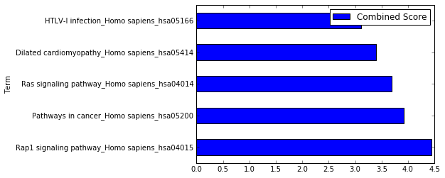

.. _example:

GSEAPY Example
==============

1. Load essential packages
==========================

.. code:: python

    %matplotlib inline
    import pandas as pd
    import gseapy as gp

Check gseapy version

.. code:: python

    gp.__version__

.. parsed-literal::

    '0.6.0'

2. Enrichr Example
==================

i. Assign enrichr with gene list object
---------------------------------------

.. code:: python

    gene_list = pd.read_table("./gene_list.txt",header=None)
    gene_list.head()

.. raw:: html

    

    <table border="1" class="dataframe">
      <thead>
        <tr style="text-align: right;">
          <th></th>
          <th>0</th>
        </tr>
      </thead>
      <tbody>
        <tr>
          <th>0</th>
          <td>CTLA2B</td>
        </tr>
        <tr>
          <th>1</th>
          <td>SCARA3</td>
        </tr>
        <tr>
          <th>2</th>
          <td>LOC100044683</td>
        </tr>
        <tr>
          <th>3</th>
          <td>CMBL</td>
        </tr>
        <tr>
          <th>4</th>
          <td>CLIC6</td>
        </tr>
      </tbody>
    </table>
    

.. code:: python

    glist = gene_list.squeeze().tolist()
    print(glist[:10])

.. parsed-literal::

    ['CTLA2B', 'SCARA3', 'LOC100044683', 'CMBL', 'CLIC6', 'IL13RA1', 'TACSTD2', 'DKKL1', 'CSF1', 'CITED1']
    

.. code:: python

    # run gseapy 
    enrichr_results = gp.enrichr(gene_list=glist, description='KEGG', gene_sets='KEGG_2016', outfile='enrichr_kegg')
    # and provide a txt file for enrichr will also work, in this way, no DataFrame will return
    # enrichr_results = gp.enrichr(gene_list='./gene_list.txt', description='KEGG', gene_sets='KEGG_2016', outfile='enrichr_kegg')

.. parsed-literal::

    Enrichr API : Analysis name:  KEGG
    Enrichr API : Enrichr Library:  KEGG_2016
    Enrichr API : Job ID: {'shortId': 'hmub', 'userListId': 1677700}
    Enrichr API : Submitted gene list: {'shortId': 'hmub', 'userListId': 1677700}
    Enrichr API : Get enrichment results: Job Id: {'shortId': 'hmub', 'userListId': 1677700}
    Enrichr API : Downloading file of enrichment results: Job Id: {'shortId': 'hmub', 'userListId': 1677700}
    Enrichr API : Results written to: enrichr_kegg.txt
    Enrichr API : You are seeing this message, because you are inside python console.
    Enrichr API : It will return a pandas dataframe for veiwing results.
    

.. code:: python

    enrichr_results.head()

.. raw:: html

    

    <table border="1" class="dataframe">
      <thead>
        <tr style="text-align: right;">
          <th></th>
          <th>Term</th>
          <th>Overlap</th>
          <th>P-value</th>
          <th>Adjusted P-value</th>
          <th>Z-score</th>
          <th>Combined Score</th>
          <th>Genes</th>
        </tr>
      </thead>
      <tbody>
        <tr>
          <th>0</th>
          <td>Rap1 signaling pathway_Homo sapiens_hsa04015</td>
          <td>19/211</td>
          <td>0.000436</td>
          <td>0.103734</td>
          <td>-1.961363</td>
          <td>4.444307</td>
          <td>PDGFRB;CSF1;FLT4;VEGFC;ARAP3;LPAR4;ADCY7;ADCY6...</td>
        </tr>
        <tr>
          <th>1</th>
          <td>Pathways in cancer_Homo sapiens_hsa05200</td>
          <td>27/397</td>
          <td>0.001816</td>
          <td>0.152127</td>
          <td>-2.083086</td>
          <td>3.922533</td>
          <td>RET;LEF1;TGFA;LPAR4;ADCY7;ETS1;ADCY6;GLI2;FGF4...</td>
        </tr>
        <tr>
          <th>2</th>
          <td>Ras signaling pathway_Homo sapiens_hsa04014</td>
          <td>18/227</td>
          <td>0.002351</td>
          <td>0.152127</td>
          <td>-1.956845</td>
          <td>3.684817</td>
          <td>PDGFRB;CSF1;FLT4;VEGFC;ETS1;GNG13;FGF4;PLD2;EF...</td>
        </tr>
        <tr>
          <th>3</th>
          <td>Dilated cardiomyopathy_Homo sapiens_hsa05414</td>
          <td>10/90</td>
          <td>0.002557</td>
          <td>0.152127</td>
          <td>-1.805957</td>
          <td>3.400689</td>
          <td>DES;SGCB;TPM2;TNNC1;LMNA;TPM1;ITGAV;ADCY7;ADCY...</td>
        </tr>
        <tr>
          <th>4</th>
          <td>HTLV-I infection_Homo sapiens_hsa05166</td>
          <td>19/258</td>
          <td>0.003877</td>
          <td>0.184562</td>
          <td>-1.843079</td>
          <td>3.114379</td>
          <td>PDGFRB;STAT5B;EGR1;JUN;CD40;FZD2;CRTC3;NFATC1;...</td>
        </tr>
      </tbody>
    </table>
    

Make a bar plot of enrichment results

.. code:: python

    enrichr_results.head(5).plot.barh(x='Term',y='Combined Score')

.. parsed-literal::

    <matplotlib.axes._subplots.AxesSubplot at 0x15859331dd8>

ii . Commandline usage
======================

You may also want to use enrichr in commandline, but not DataFrame will
print return to the console.

.. code:: python

    !gseapy enrichr -i ./gene_list.txt -d 'KEGG' -g KEGG_2016 -o 'KEGG_2016_2'

.. parsed-literal::

    Enrichr API : Analysis name:  'KEGG'
    Enrichr API : Enrichr Library:  KEGG_2016
    Enrichr API : Job ID: {'userListId': 1677701, 'shortId': 'hmuc'}
    Enrichr API : Submitted gene list: {'userListId': 1677701, 'shortId': 'hmuc'}
    Enrichr API : Get enrichment results: Job Id: {'userListId': 1677701, 'shortId': 'hmuc'}
    Enrichr API : Downloading file of enrichment results: Job Id: {'userListId': 1677701, 'shortId': 'hmuc'}
    Enrichr API : Results written to: 'KEGG_2016_2'.txt
    Enrichr API : Done
    

3. Prerank example
==================

i. Assign prank with a pandas DataFrame
---------------------------------------

.. code:: python

    rank = pd.read_table("./edb/gsea_data.gsea_data.rnk",header=None)
    rank.head()

.. raw:: html

    

    <table border="1" class="dataframe">
      <thead>
        <tr style="text-align: right;">
          <th></th>
          <th>0</th>
          <th>1</th>
        </tr>
      </thead>
      <tbody>
        <tr>
          <th>0</th>
          <td>CTLA2B</td>
          <td>2.502482</td>
        </tr>
        <tr>
          <th>1</th>
          <td>SCARA3</td>
          <td>2.095578</td>
        </tr>
        <tr>
          <th>2</th>
          <td>LOC100044683</td>
          <td>1.116398</td>
        </tr>
        <tr>
          <th>3</th>
          <td>CMBL</td>
          <td>0.877640</td>
        </tr>
        <tr>
          <th>4</th>
          <td>CLIC6</td>
          <td>0.822181</td>
        </tr>
      </tbody>
    </table>
    

.. code:: python

    # run prerank
    # enrichr library are supported by prerank module. Just provide the name
    # you may also provide a gene_sets file in gmt format, just like GSEA do.
    prerank_results = gp.prerank(rnk=rank,gene_sets='KEGG_2016',outdir='prerank_report')
    
    # or provide a rnk file will also work, but not DataFrame will return
    #prerank_results = gp.prerank(rnk="./edb/gsea_data.gsea_data.rnk",gene_sets='KEGG_2016',outdir='prerank_report')

.. parsed-literal::

    Downloading and generating Enrichr library gene sets..............
    286 gene_sets have been filtered out when max_size=1000 and min_size=15
    7 gene_sets used for further calculating
    Start to compute enrichment socres...................... Mon Aug 22 13:10:24 2016
    Start to compute esnulls................................ Mon Aug 22 13:10:24 2016
    ......This step might take a while to run. Be patient...
    Start to compute pvals.................................. Mon Aug 22 13:10:24 2016
    start to compute fdrs................................... Mon Aug 22 13:10:24 2016
    Statistial testing finished............................. Mon Aug 22 13:10:24 2016
    Start to generate gseapy reports, and produce figures... Mon Aug 22 13:10:24 2016
    Congratulations. GSEAPY run successfully................
    The Job is done.................................Goodbye! Mon Aug 22 13:10:29 2016
    

.. code:: python

    prerank_results.head(3)

.. raw:: html

    

    <table border="1" class="dataframe">
      <thead>
        <tr style="text-align: right;">
          <th></th>
          <th>es</th>
          <th>nes</th>
          <th>pval</th>
          <th>fdr</th>
          <th>gene_set_size</th>
          <th>matched_size</th>
          <th>rank_ES</th>
          <th>genes</th>
          <th>hit_index</th>
        </tr>
        <tr>
          <th>Enrich_terms</th>
          <th></th>
          <th></th>
          <th></th>
          <th></th>
          <th></th>
          <th></th>
          <th></th>
          <th></th>
          <th></th>
        </tr>
      </thead>
      <tbody>
        <tr>
          <th>Pathways in cancer_Homo sapiens_hsa05200</th>
          <td>-0.188934</td>
          <td>-1.106978</td>
          <td>0.300000</td>
          <td>0.289726</td>
          <td>397</td>
          <td>27</td>
          <td>[-0.0014992503748125937, -0.002998500749625187...</td>
          <td>[TGFBR2, LAMB3, RET, PDGFRB, ADCY6, ETS1, TGFA...</td>
          <td>[48, 125, 150, 169, 177, 196, 218, 221, 251, 2...</td>
        </tr>
        <tr>
          <th>MAPK signaling pathway_Homo sapiens_hsa04010</th>
          <td>0.179667</td>
          <td>0.550193</td>
          <td>0.814667</td>
          <td>0.875841</td>
          <td>255</td>
          <td>18</td>
          <td>[-0.0014792899408284023, -0.002958579881656804...</td>
          <td>[CACNA1H, TGFBR2, FLNC, MAP3K5, PDGFRB, PPP3CC...</td>
          <td>[31, 48, 83, 159, 169, 190, 267, 289, 317, 349...</td>
        </tr>
        <tr>
          <th>HTLV-I infection_Homo sapiens_hsa05166</th>
          <td>0.338286</td>
          <td>1.108560</td>
          <td>0.322157</td>
          <td>0.930419</td>
          <td>258</td>
          <td>19</td>
          <td>[-0.0014814814814814814, -0.002962962962962963...</td>
          <td>[CRTC3, TGFBR2, CD40, PDGFRB, ADCY6, PPP3CC, E...</td>
          <td>[27, 48, 54, 169, 177, 190, 196, 221, 228, 259...</td>
        </tr>
      </tbody>
    </table>
    

.. code:: python

    prerank_results = prerank_results.reset_index()
    prerank_results.head(5).plot.barh(y='fdr',x='Enrich_terms')

.. parsed-literal::

    <matplotlib.axes._subplots.AxesSubplot at 0x1585c27c630>

.. image:: output_19_1.png

ii . Commanline usage
=====================

You may also want to use preank in commandline, but not DataFrame will
print return to the console.

.. code:: python

    ! gseapy prerank -r ./edb/gsea_data.gsea_data.rnk -g KEGG_2016 -o prerank_report_2

.. parsed-literal::

    Downloading and generating Enrichr library gene sets..............
    286 gene_sets have been filtered out when max_size=1000 and min_size=15
    7 gene_sets used for further calculating
    Start to compute enrichment socres...................... Mon Aug 22 13:16:01 2016
    Start to compute esnulls................................ Mon Aug 22 13:16:01 2016
    ......This step might take a while to run. Be patient...
    Start to compute pvals.................................. Mon Aug 22 13:16:02 2016
    start to compute fdrs................................... Mon Aug 22 13:16:02 2016
    Statistial testing finished............................. Mon Aug 22 13:16:02 2016
    Start to generate gseapy reports, and produce figures... Mon Aug 22 13:16:02 2016
    Congratulations. GSEAPY run successfully................
    The Job is done.................................Goodbye! Mon Aug 22 13:16:07 2016
    

4. Call Example
===============

i. Assign call with a pandas DataFrame
--------------------------------------

and cls with a list object

.. code:: python

    phenoA,phenoB,class_vector =  gp.parser.gsea_cls_parser("./P53.cls")

.. code:: python

    print(class_vector)

.. parsed-literal::

    ['MUT', 'MUT', 'MUT', 'MUT', 'MUT', 'MUT', 'MUT', 'MUT', 'MUT', 'MUT', 'MUT', 'MUT', 'MUT', 'MUT', 'MUT', 'MUT', 'MUT', 'MUT', 'MUT', 'MUT', 'MUT', 'MUT', 'MUT', 'MUT', 'MUT', 'MUT', 'MUT', 'MUT', 'MUT', 'MUT', 'MUT', 'MUT', 'MUT', 'WT', 'WT', 'WT', 'WT', 'WT', 'WT', 'WT', 'WT', 'WT', 'WT', 'WT', 'WT', 'WT', 'WT', 'WT', 'WT', 'WT']
    

.. code:: python

    gene_exp = pd.read_table("./P53_resampling_data.txt")
    gene_exp.head()

.. raw:: html

    

    <table border="1" class="dataframe">
      <thead>
        <tr style="text-align: right;">
          <th></th>
          <th>NAME</th>
          <th>786-0</th>
          <th>BT-549</th>
          <th>CCRF-CEM</th>
          <th>COLO 205</th>
          <th>EKVX</th>
          <th>HCC-2998</th>
          <th>HCT-15</th>
          <th>HOP-62</th>
          <th>HOP-92</th>
          <th>...</th>
          <th>MCF7</th>
          <th>MOLT-4</th>
          <th>NCI-H460</th>
          <th>OVCAR-4</th>
          <th>SF-539</th>
          <th>SK-MEL-5</th>
          <th>SR</th>
          <th>UACC-257</th>
          <th>UACC-62</th>
          <th>UO-31</th>
        </tr>
      </thead>
      <tbody>
        <tr>
          <th>0</th>
          <td>CTLA2B</td>
          <td>111.19</td>
          <td>86.22</td>
          <td>121.85</td>
          <td>75.19</td>
          <td>208.62</td>
          <td>130.59</td>
          <td>124.72</td>
          <td>324.09</td>
          <td>242.71</td>
          <td>...</td>
          <td>163.76</td>
          <td>59.50</td>
          <td>134.12</td>
          <td>152.09</td>
          <td>197.46</td>
          <td>137.79</td>
          <td>81.53</td>
          <td>123.37</td>
          <td>81.41</td>
          <td>180.78</td>
        </tr>
        <tr>
          <th>1</th>
          <td>SCARA3</td>
          <td>460.30</td>
          <td>558.34</td>
          <td>183.55</td>
          <td>37.29</td>
          <td>158.00</td>
          <td>43.61</td>
          <td>80.83</td>
          <td>300.08</td>
          <td>1250.25</td>
          <td>...</td>
          <td>109.91</td>
          <td>120.42</td>
          <td>73.06</td>
          <td>115.03</td>
          <td>95.12</td>
          <td>37.56</td>
          <td>76.16</td>
          <td>41.10</td>
          <td>77.51</td>
          <td>519.17</td>
        </tr>
        <tr>
          <th>2</th>
          <td>LOC100044683</td>
          <td>97.25</td>
          <td>118.94</td>
          <td>81.17</td>
          <td>119.51</td>
          <td>119.88</td>
          <td>107.73</td>
          <td>165.57</td>
          <td>203.97</td>
          <td>135.43</td>
          <td>...</td>
          <td>222.84</td>
          <td>124.98</td>
          <td>114.75</td>
          <td>141.66</td>
          <td>170.19</td>
          <td>147.70</td>
          <td>157.48</td>
          <td>152.18</td>
          <td>98.89</td>
          <td>118.06</td>
        </tr>
        <tr>
          <th>3</th>
          <td>CMBL</td>
          <td>33.45</td>
          <td>55.10</td>
          <td>221.67</td>
          <td>50.30</td>
          <td>35.12</td>
          <td>75.70</td>
          <td>84.01</td>
          <td>44.12</td>
          <td>79.96</td>
          <td>...</td>
          <td>51.32</td>
          <td>117.11</td>
          <td>59.46</td>
          <td>78.46</td>
          <td>45.55</td>
          <td>49.07</td>
          <td>96.69</td>
          <td>33.09</td>
          <td>10.38</td>
          <td>52.89</td>
        </tr>
        <tr>
          <th>4</th>
          <td>CLIC6</td>
          <td>35.75</td>
          <td>41.26</td>
          <td>63.04</td>
          <td>219.86</td>
          <td>42.53</td>
          <td>54.19</td>
          <td>86.98</td>
          <td>71.20</td>
          <td>53.89</td>
          <td>...</td>
          <td>154.05</td>
          <td>31.62</td>
          <td>37.66</td>
          <td>32.64</td>
          <td>63.35</td>
          <td>27.95</td>
          <td>70.99</td>
          <td>36.25</td>
          <td>17.50</td>
          <td>49.41</td>
        </tr>
      </tbody>
    </table>
    
5 rows × 51 columns

    

.. code:: python

    # run call
    # enrichr library are supported by prerank module. Just provide the name
    # you may also provide a gene_sets file in gmt format, just like GSEA do.
    call_results = gp.call(data=gene_exp,gene_sets='KEGG_2016',cls=class_vector,outdir='call_reprot',)
    
    # or provide a rnk file will also work, but not DataFrame will return
    #call_results = gp.call(data='./P53_resampling_data.txt',gene_sets='edb/gene_sets.gmt',cls='./P53.cls',outdir='call_reprot',)
    

.. parsed-literal::

    Downloading and generating Enrichr library gene sets..............
    286 gene_sets have been filtered out when max_size=1000 and min_size=15
    7 gene_sets used for further calculating
    Start to compute enrichment socres...................... Mon Aug 22 13:17:35 2016
    Start to compute esnulls................................ Mon Aug 22 13:17:35 2016
    ......This step might take a while to run. Be patient...
    Start to compute pvals.................................. Mon Aug 22 13:17:36 2016
    start to compute fdrs................................... Mon Aug 22 13:17:36 2016
    Statistial testing finished............................. Mon Aug 22 13:17:36 2016
    Start to generate gseapy reports, and produce figures....... Mon Aug 22 13:17:36 2016
    ...Congratulations. GSEAPY run successfully!!!.............
    ...The Job is done...........................Goodbye!
    

.. code:: python

    call_results.head(5)

.. raw:: html

    

    <table border="1" class="dataframe">
      <thead>
        <tr style="text-align: right;">
          <th></th>
          <th>es</th>
          <th>nes</th>
          <th>pval</th>
          <th>fdr</th>
          <th>gene_set_size</th>
          <th>matched_size</th>
          <th>rank_ES</th>
          <th>genes</th>
          <th>hit_index</th>
        </tr>
        <tr>
          <th>Enrich_terms</th>
          <th></th>
          <th></th>
          <th></th>
          <th></th>
          <th></th>
          <th></th>
          <th></th>
          <th></th>
          <th></th>
        </tr>
      </thead>
      <tbody>
        <tr>
          <th>Ras signaling pathway_Homo sapiens_hsa04014</th>
          <td>-0.235547</td>
          <td>-0.656496</td>
          <td>0.936556</td>
          <td>0.933699</td>
          <td>227</td>
          <td>18</td>
          <td>[-0.0014814814814814814, -0.002962962962962963...</td>
          <td>[CACNA1H, RUNX3, GM967, DUSP14, RAB6B, CHRNB1,...</td>
          <td>[31, 72, 113, 141, 161, 179, 195, 198, 230, 23...</td>
        </tr>
        <tr>
          <th>PI3K-Akt signaling pathway_Homo sapiens_hsa04151</th>
          <td>0.216731</td>
          <td>0.339975</td>
          <td>0.974880</td>
          <td>0.988990</td>
          <td>341</td>
          <td>22</td>
          <td>[-0.0014903129657228018, -0.002980625931445603...</td>
          <td>[CACNA1H, RUNX3, LOC677224, DUSP14, CHRNB1, H1...</td>
          <td>[31, 72, 73, 141, 179, 183, 195, 198, 230, 237...</td>
        </tr>
        <tr>
          <th>HTLV-I infection_Homo sapiens_hsa05166</th>
          <td>-0.242165</td>
          <td>-0.678821</td>
          <td>0.913947</td>
          <td>1.140731</td>
          <td>258</td>
          <td>19</td>
          <td>[-0.001483679525222552, -0.002967359050445104,...</td>
          <td>[CHST8, ATRNL1, GRAMD1C, GM967, RAB6B, STK39, ...</td>
          <td>[71, 75, 102, 113, 161, 165, 178, 197, 230, 24...</td>
        </tr>
        <tr>
          <th>Rap1 signaling pathway_Homo sapiens_hsa04015</th>
          <td>-0.253654</td>
          <td>-0.784385</td>
          <td>0.738462</td>
          <td>1.292934</td>
          <td>211</td>
          <td>19</td>
          <td>[-0.001483679525222552, -0.002967359050445104,...</td>
          <td>[CACNA1H, DUSP14, RAB6B, SNX9, GPSM1, RHOB, HI...</td>
          <td>[31, 141, 161, 198, 230, 237, 283, 295, 319, 3...</td>
        </tr>
        <tr>
          <th>MAPK signaling pathway_Homo sapiens_hsa04010</th>
          <td>-0.409122</td>
          <td>-1.155688</td>
          <td>0.287540</td>
          <td>1.349240</td>
          <td>255</td>
          <td>18</td>
          <td>[-0.0014814814814814814, -0.002962962962962963...</td>
          <td>[BC006779, RAB6B, STK39, NPTX1, ETS1, SNX9, GP...</td>
          <td>[74, 161, 165, 178, 195, 198, 230, 237, 247, 2...</td>
        </tr>
      </tbody>
    </table>
    

.. code:: python

    call_results = call_results.reset_index()
    call_results.head(5).plot.barh(y='fdr',x='Enrich_terms')

.. parsed-literal::

    <matplotlib.axes._subplots.AxesSubplot at 0x1585bc09da0>

.. image:: output_30_1.png

ii . Commanline usage
=====================

You may also want to use call in commandline, but not DataFrame will
print return to the console.

.. code:: python

    !gseapy call -d ./P53_resampling_data.txt -g KEGG_2016 -c ./P53.cls -o call_reprot_2

.. parsed-literal::

    Downloading and generating Enrichr library gene sets..............
    286 gene_sets have been filtered out when max_size=1000 and min_size=15
    7 gene_sets used for further calculating
    Start to compute enrichment socres...................... Mon Aug 22 13:25:30 2016
    Start to compute esnulls................................ Mon Aug 22 13:25:30 2016
    ......This step might take a while to run. Be patient...
    Start to compute pvals.................................. Mon Aug 22 13:25:31 2016
    start to compute fdrs................................... Mon Aug 22 13:25:31 2016
    Statistial testing finished............................. Mon Aug 22 13:25:31 2016
    Start to generate gseapy reports, and produce figures....... Mon Aug 22 13:25:31 2016
    ...Congratulations. GSEAPY run successfully!!!.............
    ...The Job is done...........................Goodbye!
    

