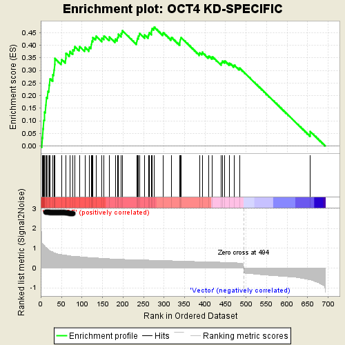
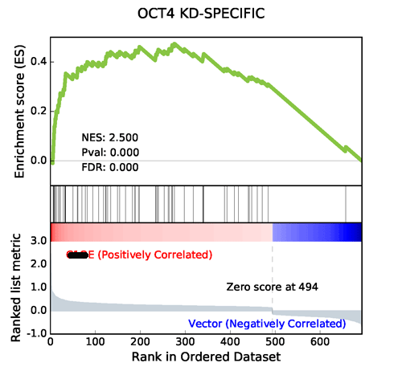
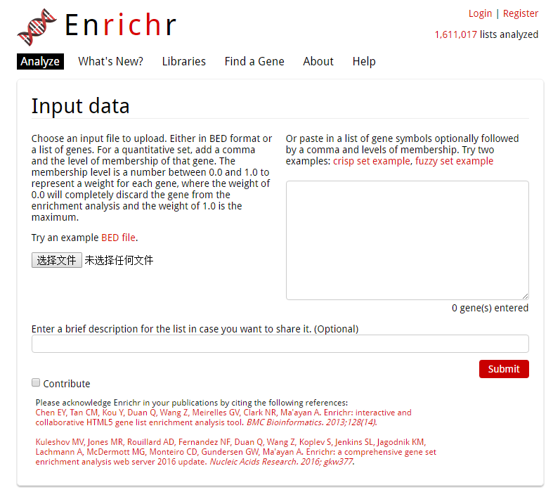

Welcome to GSEAPY's documentation!
=====================================================

GSEAPY: Gene Set Enrichment Analysis in Python.
------------------------------------------------

.. image:: https://badge.fury.io/py/gseapy.svg
    :target: https://badge.fury.io/py/gseapy

.. image:: https://img.shields.io/badge/install%20with-bioconda-brightgreen.svg?style=flat-square
    :target: http://bioconda.github.io

.. image:: http://readthedocs.org/projects/gseapy/badge/?version=latest
    :target: http://gseapy.readthedocs.org/en/latest/?badge=latest
    :alt: Documentation Status

.. image:: https://img.shields.io/badge/license-MIT-blue.svg
    :target:  https://img.shields.io/badge/license-MIT-blue.svg

.. image:: https://img.shields.io/pypi/pyversions/gseapy.svg   
    :alt: PyPI - Python Version

GSEApy is a python wrapper for **GESA** and **Enrichr**. 
--------------------------------------------------------------------------------------------

It's used for convenient GO enrichments and produce **publication-quality figures** from python. 

GSEApy could be used for **RNA-seq, ChIP-seq, Microarry** data.

`Gene Set Enrichment Analysis <http://software.broadinstitute.org/gsea/index.jsp>`_ (GSEA) 
is a computational method that determines whether an a priori defined set of genes shows 
statistically significant, concordant differences between two biological states (e.g. phenotypes). 

The full ``GSEA`` is far too extensive to describe here; see
`GSEA  <http://www.broadinstitute.org/cancer/software/gsea/wiki/index.php/Main_Page>`_ documentation for more information.

Enrichr is open source and freely available online at: http://amp.pharm.mssm.edu/Enrichr .

GSEA Java version output: 
-------------------------------------------------
This is an example of GSEA desktop application output

GSEApy ``Prerank`` module output
-----------------------------------------------
Using the same data from ``GSEA``, GSEApy reproduces the example above.

Using ``Prerank`` or ``replot`` module will reproduce the same figure for GSEA Java desktop outputs

   
   
   Generated by GSEAPY
   
   **GSEApy figures are supported by all matplotlib figure formats.** 

   You can modify ``GSEA`` plots easily in .pdf files. Please Enjoy.

GSEApy ``enrichr`` module 
-----------------------------------------------
A graphical introduction of Enrichr 

**The only thing you need to prepare is a gene list file in txt format(one gene id per row), or a python list object.**

**Note**: Enrichr uses a list of Entrez gene symbols as input. You should convert all gene names to uppercase.

For example, both a list object and txt file are supported for ``enrichr`` API

.. code:: python

    # if you prefer to run gseapy.enrchr() inside python console, you could assign a list object to
    # gseapy like this.
    gene_list = ['SCARA3', 'LOC100044683', 'CMBL', 'CLIC6', 'IL13RA1', 'TACSTD2', 'DKKL1',
                    'CSF1', 'CITED1', 'SYNPO2L']

.. code:: python

    # an alternative way is that you could provide a gene list txt file which looks like this:
    with open('data/gene_list.txt') as genes:
        print(genes.read())

    
    CTLA2B
    SCARA3
    LOC100044683
    CMBL
    CLIC6
    IL13RA1
    TACSTD2
    DKKL1
    CSF1
    CITED1
    SYNPO2L
    TINAGL1
    PTX3
       

Installation
------------

| Install gseapy package from bioconda or pypi.

.. code:: shell
   
   # if you have conda
   $ conda install -c conda-forge -c bioconda gseapy 
  
   # or use pip to install the latest release
   $ pip install gseapy

| You may instead want to use the development version from Github, by running

.. code:: shell

   $ pip install git+git://github.com/BioNinja/gseapy.git#egg=gseapy

Dependency
--------------
* Python 3+

Mandatory
~~~~~~~~~

* Numpy 
* Scipy
* Pandas 
* Matplotlib
* Requests(for enrichr API)
   

For API information to use this library, see the :ref:`run`. 